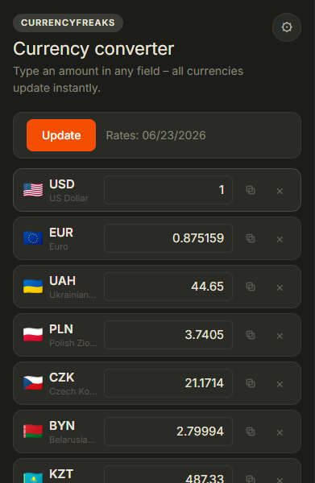

# Configurable Currency Converter

A WXT + React browser extension for instant multi-currency conversion powered by CurrencyFreaks.



## Features

- Opens with `1 USD` by default.
- Default currencies: USD, EUR, UAH, PLN, CZK, KZT, BYN.
- Type an amount in any currency field and all other fields update instantly.
- Configurable currency list: add and remove currency codes.
- Update rates for all selected currencies with one button.
- CurrencyFreaks API key is stored locally in the extension.
- Light and dark themes.
- RU/EN language switcher, translations are stored in `src/locales/*.yml`.
- Compact currency list designed to fit the default set without scrolling.
- Rate date is formatted locally, without showing raw API values like `00:00:00+00`.

## Project Structure

```text
project/
  assets/
  public/
    icons/
  src/
    assets/
    components/
    entrypoints/
    env/
    hooks/
    locales/
    types/
    utils/
  .gitignore
  LICENSE
  README.md
  package.json
  tsconfig.json
  wxt.config.ts
```

## Getting Started

Install dependencies:

```bash
npm install
```

Run the extension in development mode:

```bash
npm run dev
```

## Build

```bash
npm run build
```

The production Chrome MV3 extension will be generated in:

```text
.output/chrome-mv3
```

## CurrencyFreaks API

You need a CurrencyFreaks API key. The extension uses the latest rates endpoint:

```text
https://api.currencyfreaks.com/v2.0/rates/latest?apikey=YOUR_APIKEY&symbols=USD,EUR,...
```

Rates are fetched with USD as the base currency. Conversion from any selected currency is calculated locally, so the paid `base` parameter is not required.

> Note: CurrencyFreaks discourages exposing API keys in client-side JavaScript. For personal use this may be acceptable, but for a public extension you should use a backend/proxy to protect the key.

## Scripts

```bash
npm run dev          # Start WXT dev server
npm run build        # Build Chrome MV3 extension
npm run compile      # Type-check with TypeScript
npm run zip          # Create extension zip
npm run dev:firefox  # Start Firefox dev build
npm run build:firefox
npm run zip:firefox
```

## License

MIT
